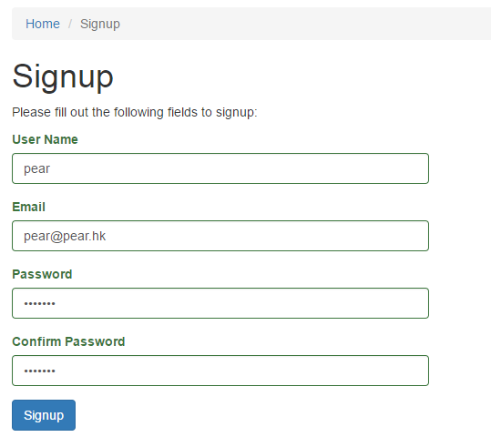
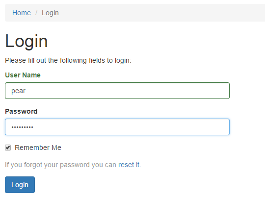
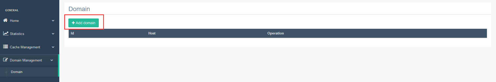
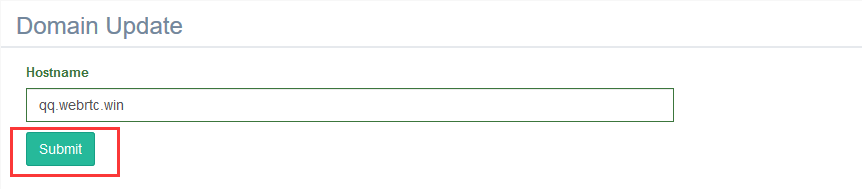
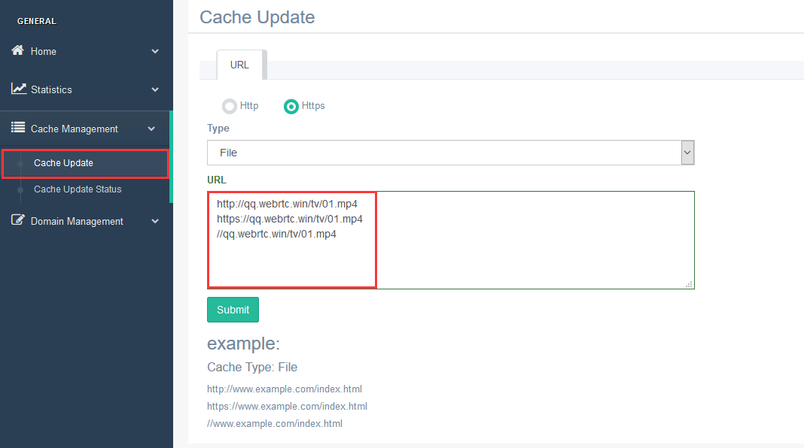
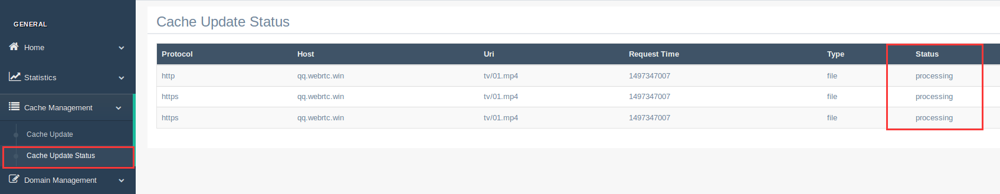
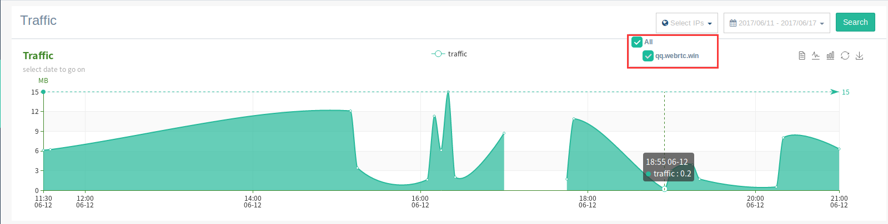

# For CPs

## Web端的一键接入

* **内容提供商**可以“一键接入”Pear Fog CDN：

``` js
<video id="v1"></video>
<script src="PearPlayer.js"></script>
<script>
    var PearPlayer = require('PearPlayer');
    PearPlayer('#v1',{
        type: 'mp4',
        src: 'https://xxx.webrtc.win/tv/f.mp4',
        token: token
    });
</script>
```

> FogVDN是Web友好的，使用开放的Web标准（不需要额外的任何插件，只需要HTML5和WebRTC）
> 非常容易集成到现有项目中，只需几行JS代码便可以集成

* 默认采用First-aid算法


## 移动端的播放器SDK或协议嵌入

Pear为Android和iOS的开发者提供方便的协议或SDK嵌入方式... 

## 服务对接API

### 权限验证
```
POST https://api.webrtc.win:7401/v1/oss/cp/login  HTTP/1.1

Header: X-Pear-Token: token
Header: Content-Type: application/json
```
请求
```json
{
    "user_name": "用户名 string",
    "password":  "密码   string"
}
```
响应
```json
{
    "token": "Token string"
}
```

### 上报视频调度维度API
- ISP
- 国家、区域、省份
- 热度

```
GET https://api.webrtc.win:7401/v1/vdn/owner/{user_id:[0-9]+}  HTTP/1.1

Header: X-Pear-Token = token
```
请求
```json
[
    {
        "video": {
            "scheme": "string",
            "host":   "string",
            "uri":    "string"
        },
        "regions": [
            {
                "country":    "国家 string",
                "region":     "区域 string",
                "province":   "省份 string",
                "city":       "市   string",
                "isp":        "ISP  string",
                "popularity": "热度 int",
            }
        ],
    }
]
```
响应
```json
{
    "err_msg": "string"
}
```

### 流量查看

```
GET https://api.webrtc.win:7401/v1/oss/cp/53/traffic  HTTP/1.1

Header: X-Pear-Token = token
```
请求参数
```
host:       域名
start_date: 开始日期(时间戳)
end_date:   结束日期(时间戳)
```

响应
```json
[
    {
        "host": "域名 string",
        "values": [
            {
                "traffic": "流量   int",
                "time":    "时间戳 int"
            }
        ]
    }
]
```

## CP用户管理平台 OSS

### 用户注册 [signup](https://oss.webrtc.win/site/signup)


### 用户登陆 [login](https://oss.webrtc.win/site/login)


### 域名管理
#### 查看域名


#### 添加域名


### 视频缓存配置
#### 配置视频缓存


#### 查看视频缓存配置


### 流量查看
- 域名和时间组合查询流量（域名和时间可选）



