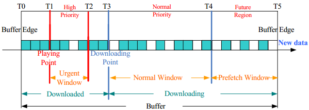

# For CPs

## Web端的一键接入

内容提供商可以“一键接入”Pear Fog CDN：

``` js
<video id="v1"></video>
<script src="PearPlayer.js"></script>
<script>
    var PearPlayer = require('PearPlayer');
    PearPlayer('#v1',{
        type: 'mp4',
        src: 'https://xxx.webrtc.win/tv/f.mp4',
        token: token
    });
</script>
```

> FogVDN是Web友好的，使用开放的Web标准（不需要额外的任何插件，只需要HTML5和WebRTC）
> 非常容易集成到现有项目中，只需几行JS代码便可以集成

* 默认采用First-aid算法


## 移动端的播放器SDK或协议嵌入

Pear为Android和iOS的开发者提供方便的协议或SDK嵌入方式... 
