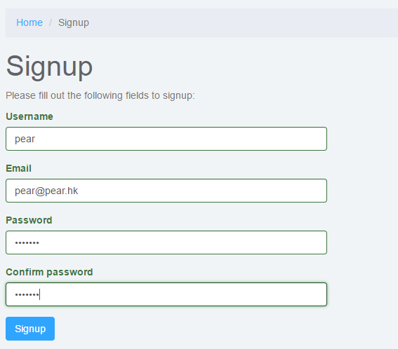
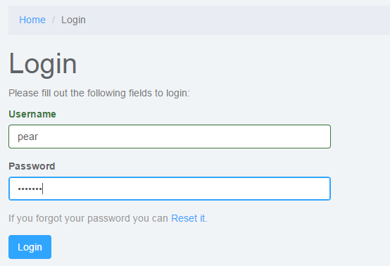
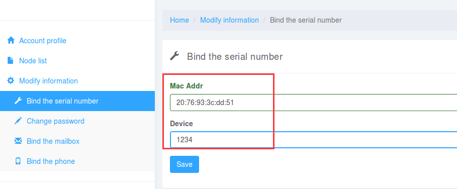
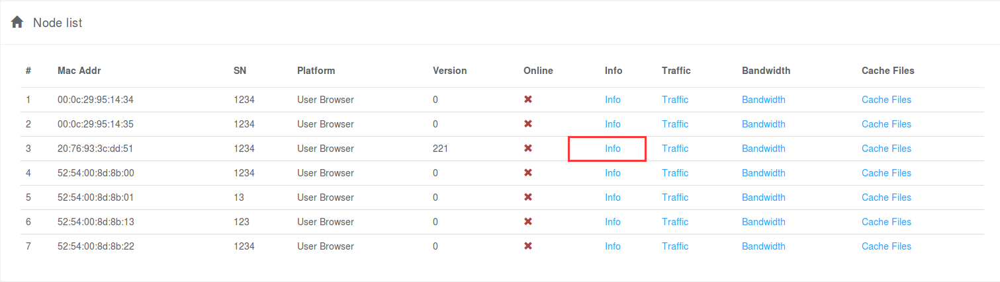
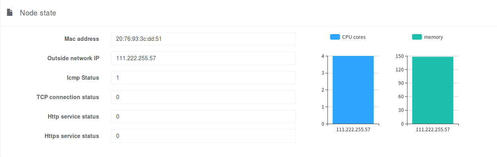
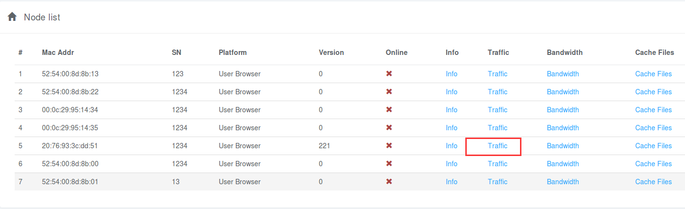
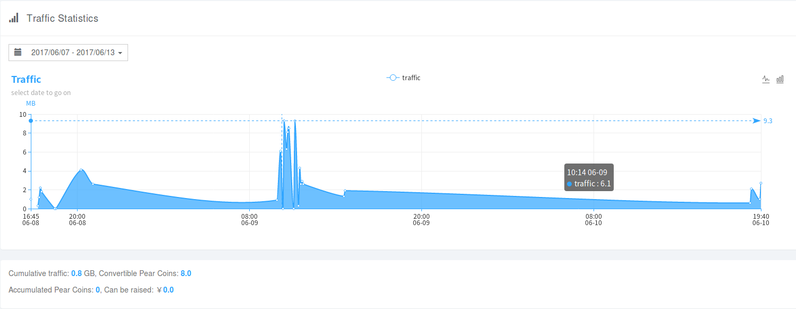
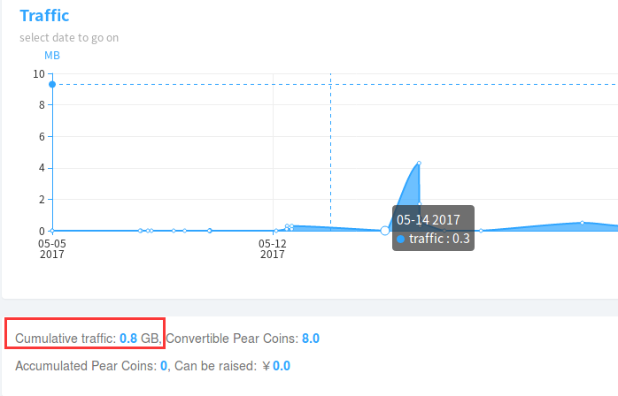

# For Device Oners

 边缘设备的机主或管理员，可以通过在设备上安装Pear Fog Suite来加入“梨享雾计算”计划。

## Owner Web管理平台(NMS)

### 用户注册 [signup](https://nms.webrtc.win/site/signup)


### 用户登陆 [login](https://nms.webrtc.win/site/login)


### 设备绑定
#### 手动绑定设备
- 通过NMS手动输入设备MAC地址及序列号SN


#### 微信绑定设备
- 通过微信扫描设备上的二维码进行绑定


### 设备绑定列表


### 设备详细信息


### 流量查看
#### 查看流量入口


#### 查看某个设备的流量
- 按日期范围查询


#### 流量兑换
- 查看每台设备近3个月的流量
- 及时提现成Pear Coin

#### 查看某个设备的总流量


> 继续补充通过weixin等平台兑换Pear Coin


## 服务对接API

### 登录，获取token
```
POST https://api.webrtc.win:7201/v1/vdn/owner/login  HTTP/1.1

Header: Content-Type: application/json
```
**请求**
```json
{
    "user_name": "用户名 string",
    "password":  "密码   string"
}
```
**响应**
```json
{
    "token": "Token string"
}
```

### 流量查看
- 获取一定时间段内的流量（包括多个Mac）

```
GET https://api.webrtc.win:7201/v1/vdn/owner/{user_id:[0-9]+}/traffic  HTTP/1.1

Header: X-Pear-Token = token
Header: Content-Type: application/json
```
**请求参数**
```
start_date: 开始日期(时间戳)
end_date:   结束日期(时间戳)
```

**响应**
``` json
[
    {
        "mac_addr": "MAC地址 string",
        "values": [
            {
                "traffic": "流量 int",
                "time":    "时间戳 int"
            }
        ]
    }
]
```

## 附：Pear推荐的合作厂商设备列表
- Newifi2/3
- QNAP TS-x51 Series
