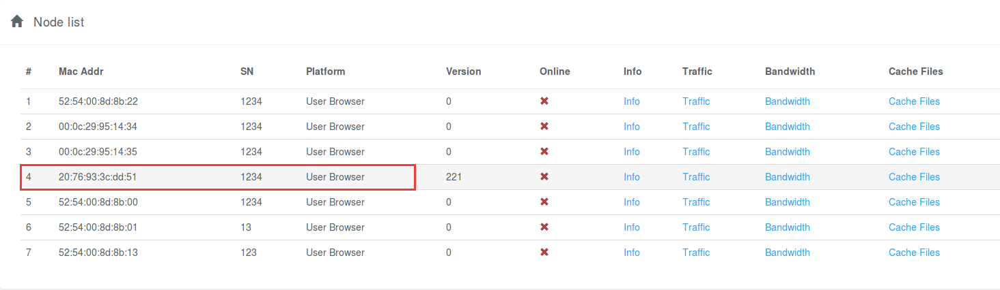

# For Device Oners

 边缘设备的机主或管理员，可以通过在设备上安装Pear Fog Suite来加入“梨享雾计算”计划。

## 附：Pear推荐的合作厂商设备列表
   + Newifi2/3
   + QNAP TS-x51 Series

## Owner
## 设备绑定流程和设备信息查询
### 用户注册(https://nms.webrtc.win/site/signup)


### 手动绑定设备(https://nms.webrtc.win/node-info/updatedevicesn)


### 微信绑定设备（运营期制作二维码贴在设备上）


### 查看绑定设备关键信息（可绑定多台设备）


### 查看某个设备其他信息（CPU、Memory、IP，及服务健康状态，目前节点走HTTPS和dataChannel(DTLS)通道以保证数据传输的安全）
#### 所有设备的基本信息列表


### 查看流量
### 暂时提供一个统一的账号，所有节点的流量全部统计到这个统一的账号，查询流量API如下(账号: newifi2 密码: 123456)
#### 查看所有设备下的流量列表


#### 登录，获取token
```  shell
curl  -X POST https://api.webrtc.win:7201/v1/vdn/owner/login \
      -H "Content-Type:application/json" \
      -d '{
              "user_name": "newifi2",
              "password":  "123456"
          }'

```
#### 获取一定时间段内的流量（包括多个Mac）
``` shell
curl -v -X GET "https://api.webrtc.win:7201/v1/vdn/owner/51/traffic?start_date=1494780990&end_date=1495890990" \
    -H "X-Pear-Token: ${token}" \
    -H "Content-Type:application/json" 
```

返回的真实流量格式及数据如下：
``` js
[
      {
            "mac_addr": "20:76:93:3c:dd:51",
            "values": [
            {
              "traffic": 48,
              "time": 1494834900
            }]
      }，
      {
          "mac_addr": "20:76:93:58:90:12",
          "values": [
            {
              "traffic": 16449536,
              "time": 1495440300
            }]
      }
]
```

  
#### 完整的Shell脚本如下（可以直接运行）
``` shell
#/bin/sh
# Pear Limited
r=`curl -X POST https://api.webrtc.win:7201/v1/vdn/owner/login \
         -H "Content-Type:application/json" \
         -d '{
                 "user_name": "newifi2",
                 "password":  "123456"
            }'`
user_id=`echo $r | cut -d ":" -f2 | cut -d "," -f1`
user_id="${user_id// /}"
echo $user_id;
token=`echo $r | cut -d "\"" -f14 `
#echo ${token}
curl -v -X GET "https://api.webrtc.win:7201/v1/vdn/owner/${user_id}/traffic?start_date=1494780990&end_date=1496443900" \ 
      -H "X-Pear-Token: ${token}" \
      -H "Content-Type:application/json" 
```
### 流量分布显示图
#### 查看某个设备下的流量


### 流量兑换，查看每台设备的流量，统计3个月的流量，及时提现成Pear Coin。
#### 查看某个设备下的总流量


> 继续补充通过weixin等平台兑换Pear Coin
