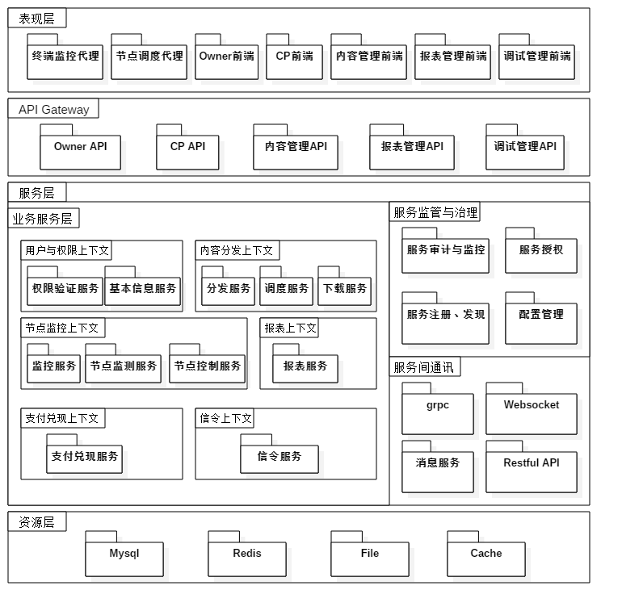

# For Fog-Microservices - Pear Fog（梨享雾计算）微服务架构
Pear Fog（梨享雾计算）使用微服务架构搭建分布式平台。

## 微服务优势
### 模块化
微服务强调模块化的结构，这对大团队特别重要。
### 独立部署
简单的服务更容易部署，而且由于它们是自治的，一旦出了问题，不会导致整个系统的故障
### 技术多样性
有了微服务，你可以混合使用多种编程语言、开发框架以及数据存储技术

## 逻辑架构
按照职责、通用性、技术特性综合考虑和计量，逻辑架构设计如下图： 

## 技术栈
### 开发语言
- Golang
- C/C++
- Node.js
- PHP
- Javascript

### 持续集成及发布
- Git
- Docker
- Jenkins
- Nginx

### 服务间通讯
- grpc
- Restful API
- Websocket
- 消息服务

### 服务监管与治理
- Consul

### 存储
- Mysql
- Redis
- File
- Cache

### 安全性
- 通讯：Https
- 授权：JWT、OAuth2.0
- 密钥：Hash + Salt

### 其它
- Scrum敏捷开发方法
- EDA (事件驱动架构)
- DDD (领域驱动设计分析方法)
