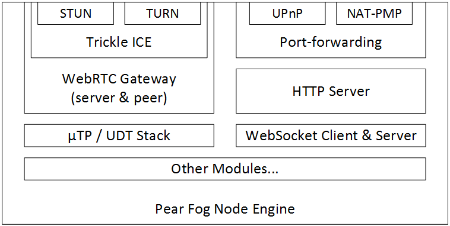
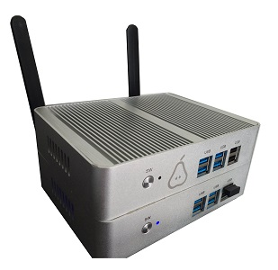
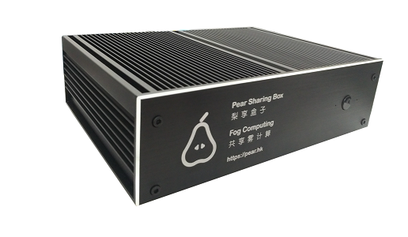
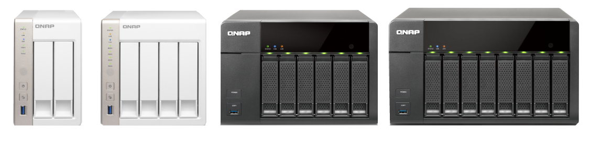
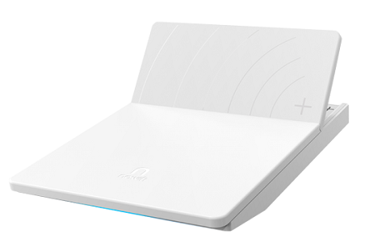
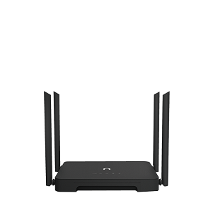
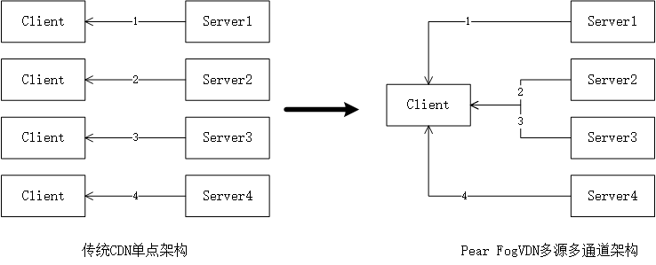
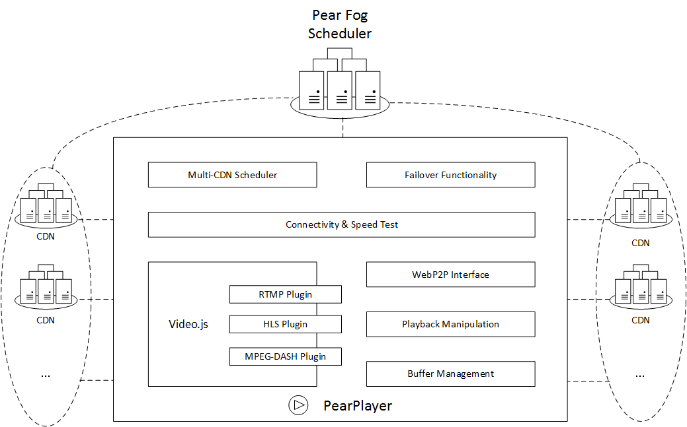

# FogVDN - The Video CDN in the Fog with Crowdsourcing

  Pear（梨享）出品的一个面向未来、专注于服务在线视频流媒体的CDN。它是Pear Fog（梨享雾计算）平台的重要组成部分，具有以下特色：

##  集成方便，CP或CDN均可“一键启用”

``` js
<video id="v1" src="https://example.com/v1.mp4"></video>
<script src="PearPlayer.js"></script>
<script>
    var player = new PearPlayer('#v1', token, opts);
</script>
```

> FogVDN是Web友好的，使用开放的Web标准（不需要任何额外插件，只需要HTML5和WebRTC）
> 非常容易集成到现有项目中，只需几行JS代码便可以集成

##  众包，海量节点，广覆盖

   - 拥有海量可持续稳定提供服务的节点。
   - 大部分带宽、存储、计算资源通过众包方式收集自终端用户稳定在线的边缘设备。
   - 服务能力覆盖全部地域、所有运营商、每处网络边缘。
   - 动态、实时的感知和调度，让数据传输距离尽可能接近“零跳”。



    

##  超低延迟

通过海量的节点，及动态、实时的感知和调度，让数据传输距离尽可能接近“零跳”。

##  多源，鲁棒

   1. 在数据传输上，传统CDN是一对多的，即用户平均服务质量和用户数呈“逆线性关系”。Pear FogVDN采取从多源多通道获取文件数据的方案，减少了对单点和单链路的依赖，解决了播放高清视频而单链路无法满足此带宽出现的卡顿问题，通过UDP通道也解决弱网环境丢包的问题，让用户获得更佳的观看体验。

  
  
   2. 即使在服务中，也会动态探测其他节点的健康状态和服务能力，自动切换到最优的节点组并实时调整数据比例，保障用户体验。

##  支持开放的、国际标准的协议，如：

   + [HTTP2](https://en.wikipedia.org/wiki/HTTP/2)
   + [WebRTC](https://webrtc.org/)
   + [HLS](https://developer.apple.com/streaming/)
   + [DASH](http://mpeg.chiariglione.org/standards/mpeg-dash)
  
##  Web友好，“连接一切”



##  高效率，在VoD、Live、VoIP等场景中均有专门优化的定制算法

##  安全可靠

   支持整个传输链路的安全存储与传输，防止数据被篡改，避免版权文件的泄漏及内容劫持等。
   
   * 所有边缘节点支持TLS，HTTP默认使用HTTPS(HTTP2.0)通道。
   * WebRTC通道传输数据使用SCTP协议和DTLS加密来保护。
   * 信令通信是通过安全的WebSocket完成的，该WebSocket也使用TLS/SSL加密。
   * 可选的数据加密，与分段、分片、分块。

##  低成本

   相对于传统CDN依赖于昂贵的机房、服务器和租赁带宽，Pear FogVDN凭借海量的节点和共享经济的模式，价格相比传统CDN显著降低。

##  网络感知、内容感知、用户感知

   1. 精确解析
   
      * 识别访问用户的真实IP地址（即使在使用OpenDNS甚至VPN等情况下），并99.9%地映射到所处区域、ISP，筛选出距离近乎“零跳”的节点为用户提供优质服务。

   2. 高效内容分发与分布网络
   
      * 精确、实时感知数据热度，把内容快速Push到边缘节点。

   3. 大数据推荐、预测，及内容预取
   
      * 提供API和相关服务，对于有用户画像和资源属性分析能力的CP，内容预取和传播可精确到用户和“小世界”(Small-world)社交网络粒度。
