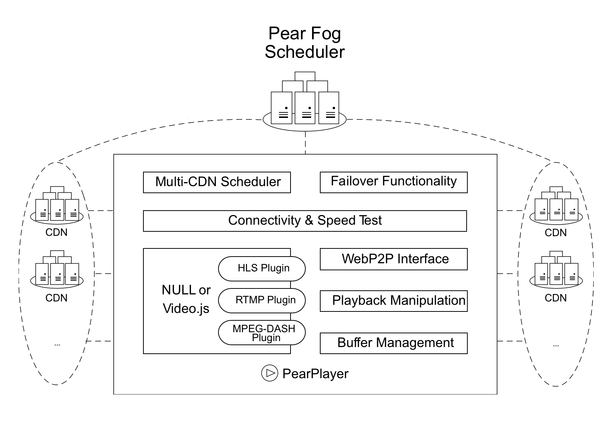

# FogVDN - The Video CDN in the Fog with Crowdsourcing

  Pear（梨享）出品的一个面向未来、专注于服务在线视频流媒体的CDN。它是Pear Fog（梨享雾计算）平台的重要组成部分，具有以下特色：

## 集成方便，CP或CDN均可“一键启用”

``` js
<video id="v1" src="https://example.com/v1.mp4"></video>
<script src="PearPlayer.js"></script>
<script>
    var PearPlayer = require('PearPlayer');
    PearPlayer('#v1',{
        type: 'mp4',
        token: token
    });
</script>
```

> FogVDN是Web友好的，使用开放的Web标准（不需要额外的任何插件，只需要HTML5和WebRTC）
> 非常容易集成到现有项目中，只需几行JS代码便可以集成

## 众包，海量节点，广覆盖

   - 拥有海量可持续稳定提供服务的节点。
   - 大部分带宽、存储、计算资源通过众包方式收集自终端用户稳定在线的边缘设备。
   - 服务能力覆盖全部地域、所有运营商、每处网络边缘。
   - 动态、实时的感知和调度，让数据传输距离尽可能接近“零跳”。


## 支持开放的、国际标准的协议，如：

   + [HTTP2](https://en.wikipedia.org/wiki/HTTP/2)
   + [WebRTC](https://webrtc.org/)
   + [HLS](https://developer.apple.com/streaming/)
   + [DASH](http://mpeg.chiariglione.org/standards/mpeg-dash)
  
## Web友好，“连接一切”



## 高效率，在VoD、Live、VoIP等场景中均有专门优化的定制算法

## 安全可靠

   支持整个传输链路的安全传输，防止文件被篡改,避免版权文件的泄漏及内容劫持等。
   
   >传输链：源站-->内部Cache服务器-->边缘服务器-->海量节点-->终端用户 
   
   
   * 所有边缘节点支持TLS，HTTP默认使用HTTPS(HTTP2.0)通道
   * WebRTC通道传输数据使用SCTP协议和DTLS加密来保护
   * 信令通信是通过安全的WebSocket完成的，该WebSocket也使用TLS/SSL加密

## 核心技术

1. 独立研发的分布式CDN通过共享经济的模式改变了传统CDN的技术结构，通过海量的节点，从而让数据传输距离可近至1km。

2. 在数据传输上，传统CDN是一对一的，Pear FogVDN采用从多源多通道获取文件数据，减少了对单点和单链路的依赖，解决了播发高清视频而单链路无法满足此带宽出现的卡顿问题，通过UDP通道也解决弱网环境丢包的问题，让用户获得更佳的下载体验。
---
  
---
3. 在数据安全方面，支持整个传输链路的安全传输。

4. 价格优势，相对于传统CDN依赖于昂贵的机房服务器，我们依赖于海量的节点共享经济的模式，保守估计价格最多为传统CDN价格的一半。
